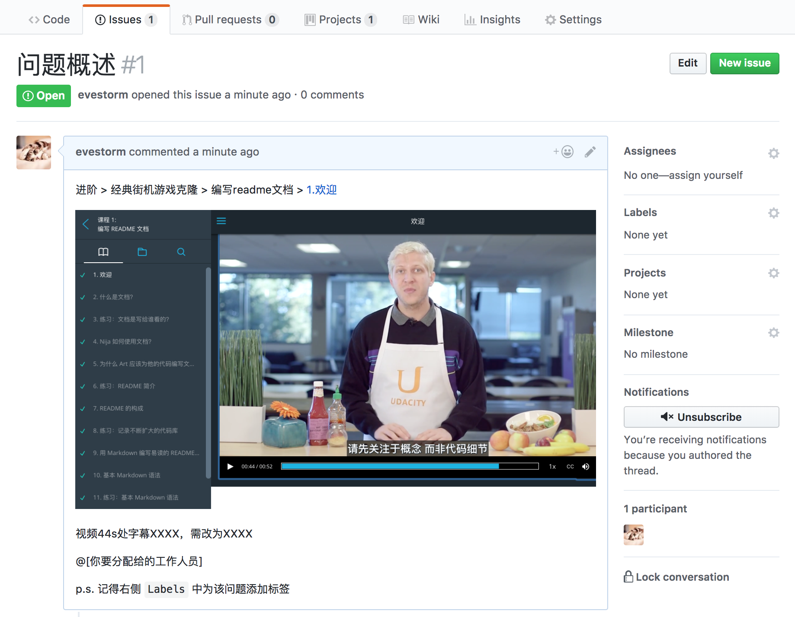

## 前端开发-免费试课项目

### 简介

...

### 目的

...

### 如何提供反馈（Issue）

#### 创建Issue

打开仓库链接：https://github.com/udacity/FEND-Beta-Test-zh/issues ，选择 `Issues` 面板新建 `issue` ：

上图是新建 Issue 的界面，左侧填入 Issue 的标题和内容，右侧是四个配置项:

- Assignees：人员

  > Assignee 选择框中显示了所有成员，如果有需要，你可以指派该 Issue 的处理人员（优达学城工作人员）。
  >
  > 优达学城工作人员：
  >
  > 本地化负责人：@sylviasun916
  >
  > 前端开发课程经理：@evestorm

- Labels：标签

  > 你**需要**为你创建的问题贴上标签，这样有利于我们分类管理和过滤查看。

- Projects：项目

- Milestone：里程碑

创建完毕后点击 `Submit new issue` ，提交完毕。

#### 反馈模板

